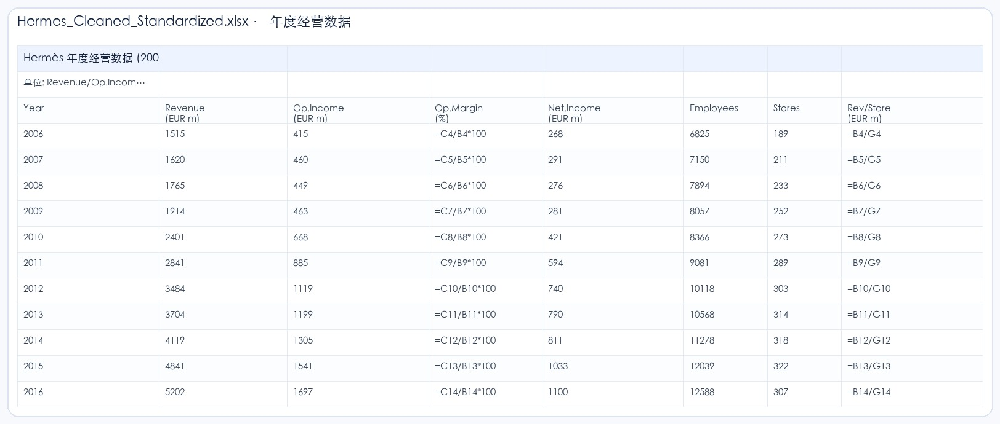

# Hermes Anthropic XLSX Skill Eval

> 日期：2026-06-22  
> Run ID：`hermes-anthropic-xlsx-20260622`  
> Session：`cli:hermes-anthropic-20260622-155512`  
> 模型：`deepseek-v4-pro` via DashScope OpenAI-compatible  
> 配置：`nanobot/configs/tableclaw-bailian-dashscope-anthropic-xlsx-only.json`  
> 输入：`workspace/uploads/Hermes_20Year_Panorama_2006_2025.xlsx`

## 1. 评测目的

这条 run 用来评估 TableClaw 在“非四川财资业务场景”下的通用 table workflow 能力。

核心问题不是“业务 domain knowledge 是否拟合”，而是：

- 模型能否识别这是通用 spreadsheet/workbook 任务。
- 模型是否会选择并读取 `anthropic-xlsx`。
- 在禁用小 table skills 和业务 domain skill 的评测设计下，模型能否完成复杂 workbook artifact 任务。
- 是否能记录完整 tool trace、skill 选择、耗时、token、产物和验证结果。

## 2. 用户任务

原始任务包含三部分：

1. 对 `Sheet1` 的 5157 行日频数据进行标准化整理：拆分日期、股价、市值、营收等核心字段，去除空列与无效行，规范统一表头，解决原表格表头错位、空列过多的问题。
2. 基于原表格的爱马仕数据，补充 LV 等同赛道头部企业的同周期经营数据，搭建多公司对标分析表，计算核心指标的对标差异、行业排名、增长差距，实现横向对标对比。
3. 基于 20 年历史经营数据，构建爱马仕 2026-2030 年未来 5 年财务预测模型，覆盖营收、成本、利润、门店扩张等核心维度。

## 3. Skill / Tool 可见性设计

本评测线的目标是通用 table task，不走四川财资 domain pack。

当前归档配置禁用：

- `sichuan-finance`
- `xlsx`
- `table-read`
- `table-clean`
- `table-validate`
- `table-report`
- `table-formula-debug`
- `table-chart`

主要可见 spreadsheet skill：

- `anthropic-xlsx`

说明：Hermes 本次运行时已经隐藏 `xlsx` 与早期小 table skills；归档本文档时，`anthropic-xlsx-only` 配置进一步把 `sichuan-finance` 也加入 `disabledSkills`，作为后续通用评测的标准配置。

这次 Hermes run 的实际 trace 显示，模型第一步就读取了 `anthropic-xlsx`：

```text
Reading the anthropic-xlsx skill
↳ read …/skills/anthropic-xlsx/SKILL.md
```

工具链中没有出现 `tableclaw_domain_knowledge`，说明本任务没有进入四川财资业务知识路径。

## 4. 运行统计

Usage 记录：

```json
{
  "latency_ms": 695007,
  "model": "deepseek-v4-pro",
  "provider": "OpenAICompatProvider",
  "session_key": "cli:hermes-anthropic-20260622-155512",
  "stop_reason": "completed",
  "tools_used": [
    "read_file",
    "tableclaw_inspect",
    "read_file",
    "exec",
    "exec",
    "exec",
    "exec",
    "exec",
    "exec",
    "exec",
    "exec",
    "exec",
    "write_file",
    "exec",
    "exec",
    "exec"
  ],
  "usage": {
    "cached_tokens": 356352,
    "completion_tokens": 40034,
    "prompt_tokens": 622777,
    "total_tokens": 662811
  }
}
```

| 指标 | 数值 |
| --- | ---: |
| 总耗时 | 695.007 秒 |
| 总 token | 662,811 |
| Prompt token | 622,777 |
| Completion token | 40,034 |
| Cached token | 356,352 |
| 工具调用数 | 16 |
| 结束状态 | completed |

## 5. 工具轨迹

| 阶段 | 工具 / 动作 | 作用 |
| --- | --- | --- |
| 1 | `read_file` | 读取 `anthropic-xlsx/SKILL.md`，建立 spreadsheet artifact 任务策略。 |
| 2 | `tableclaw_inspect` | 快速扫描原始 workbook：5157 行、20 列、2 个 sheet、合并单元格。 |
| 3 | `read_file` | 读取完整 inspect 结果。 |
| 4 | `exec (python/openpyxl)` | 探索前 50 行，发现实际 sheet 名不是 `Sheet1`，而是 `Sheet1 · 长周期增长主线`。 |
| 5 | `exec (python/openpyxl)` | 重新探索真实 sheet，识别日频、年频、关键事件等堆叠结构。 |
| 6 | `exec (python/openpyxl)` | 探索 `Sheet2 · 结构演进`，识别品类/地区/门店/利润率结构数据。 |
| 7 | `exec (python/openpyxl)` | 生成清洗标准化 workbook。 |
| 8 | `exec (python/openpyxl)` | 生成奢侈品同行对标 workbook。 |
| 9 | `exec (python/openpyxl)` | 首次生成预测模型，因长 heredoc / 参数格式问题失败。 |
| 10 | `write_file` | 将预测模型脚本写入 `build_forecast.py`，避免 heredoc 截断。 |
| 11 | `exec (python)` | 执行 `build_forecast.py`，生成预测模型 workbook。 |
| 12 | `exec (python)` | 验证 3 个输出文件结构、sheet、公式数量和关键预测值。 |
| 13 | `exec rm` | 删除临时脚本。 |

完整日志：

- [run_cli_output.txt](artifacts/hermes-anthropic-xlsx-20260622/logs/run_cli_output.txt)
- [usage.json](artifacts/hermes-anthropic-xlsx-20260622/logs/usage.json)
- [tool result 1](artifacts/hermes-anthropic-xlsx-20260622/tool-results/call_b8ab9b4d60f8494293bab51e.txt)
- [tool result 2](artifacts/hermes-anthropic-xlsx-20260622/tool-results/call_6ac31c9bbb9842b59757b561.txt)

## 6. 关键中间判断

模型没有把原始 workbook 当成一个扁平表，而是识别为多段堆叠结构：

- `Sheet1 · 长周期增长主线`
  - Rows 1-9：标题、摘要指标和来源说明。
  - Rows 10-5120：日频股价数据，约 5110 行。
  - Row 5121：空分隔行。
  - Rows 5122-5142：年度经营数据，2006-2025。
  - Rows 5145-5157：关键事件。
- `Sheet2 · 结构演进`
  - 品类收入结构。
  - 地区收入结构。
  - 门店 / 人效 / 利润率结构。

重要恢复点：

- 用户说 `Sheet1`，但实际 sheet 名是 `Sheet1 · 长周期增长主线`，模型通过 openpyxl 探索纠正。
- 原始 `Sheet1` 包含多个逻辑表和大量空列，模型将其拆成多个语义 sheet。
- 预测模型首次长脚本执行失败后，模型改为写入脚本文件再执行，恢复成功。
- 对标任务中，原表只包含 Hermès 和 LVMH 股价，不包含完整 Kering / Richemont 经营数据；模型在输出中将外部 peer 数据标为估算，并提供假设说明。

## 7. 输出产物

### 7.1 清洗标准化 Workbook

文件：

- [Hermes_Cleaned_Standardized.xlsx](artifacts/hermes-anthropic-xlsx-20260622/outputs/Hermes_Cleaned_Standardized.xlsx)

预览：



结构：

| Sheet | 行数 | 列数 | 非空单元格 | 公式数 |
| --- | ---: | ---: | ---: | ---: |
| 日频股价数据 | 5113 | 4 | 20,446 | 0 |
| 年度经营数据 | 24 | 12 | 256 | 99 |
| 关键事件 | 12 | 4 | 45 | 0 |
| 结构演进 | 53 | 9 | 230 | 0 |
| 概览KPI | 13 | 2 | 25 | 0 |

评估：

- 完成原始堆叠表拆分。
- 去除日频段 F-T 空列。
- 将年频经营数据从错位区域重构为规范表。
- 保留结构演进与关键事件信息。

### 7.2 奢侈品同行对标 Workbook

文件：

- [Luxury_Peer_Benchmarking.xlsx](artifacts/hermes-anthropic-xlsx-20260622/outputs/Luxury_Peer_Benchmarking.xlsx)

预览：


结构：

| Sheet | 行数 | 列数 | 非空单元格 | 公式数 |
| --- | ---: | ---: | ---: | ---: |
| 对标分析总览 | 16 | 8 | 107 | 36 |
| 营收增长对比 | 17 | 6 | 62 | 17 |
| 利润率对比 | 9 | 6 | 44 | 6 |
| 估值对比 | 9 | 6 | 44 | 6 |
| 数据来源与假设 | 26 | 2 | 38 | 0 |

评估：

- 搭建 Hermès / LVMH / Kering / Richemont 横向对标框架。
- 计算 rank、premium/discount、growth gap、margin gap、valuation gap。
- 对非源表数据做估算标记和来源假设说明。
- 后续若接入外部财报/RAG，应替换估算 peer data。

### 7.3 2026-2030 预测模型 Workbook

文件：

- [Hermes_2026_2030_Forecast.xlsx](artifacts/hermes-anthropic-xlsx-20260622/outputs/Hermes_2026_2030_Forecast.xlsx)

预览：


结构：

| Sheet | 行数 | 列数 | 非空单元格 | 公式数 |
| --- | ---: | ---: | ---: | ---: |
| 假设面板 | 29 | 3 | 58 | 5 |
| 利润表预测 | 19 | 7 | 120 | 79 |
| 门店与人力 | 14 | 7 | 72 | 50 |
| 预测总览 | 16 | 7 | 96 | 73 |
| 情景分析 | 12 | 4 | 42 | 0 |

评估：

- 构建 2025A-2030E 模型。
- 使用假设面板驱动，而不是只输出 Python 计算值。
- 覆盖收入、成本、经营利润、净利润、门店、人效和情景分析。
- 公式数量较多，说明模型具备可调参和可审计基础。

## 8. 结果判断

本次 run 判定为：**通过 smoke / artifact eval v0**。

通过点：

- 模型正确选择并读取 `anthropic-xlsx`。
- 没有调用四川财资 `tableclaw_domain_knowledge`。
- 识别并修正真实 sheet 名。
- 识别堆叠表结构，并拆分为语义 sheet。
- 成功输出 3 个可用 `.xlsx` artifact。
- 输出文件包含公式、假设面板、来源说明和结构化 sheet。
- 运行日志、tool trace、usage 和预览图已归档。

不足：

- 耗时和 token 很高：约 695 秒、662,811 tokens，不适合作为高频 QA 主路径。
- 同行对标中的 Kering / Richemont 等 peer 数据不是从可靠外部数据源自动召回，而是估算框架。
- 当前验证是结构性检查，还没有 LibreOffice 重算 / 公式错误扫描 / workbook render 全量检查。
- `anthropic-xlsx` 大 skill 更适合复杂 artifact 任务，不适合每轮都作为 always skill。

## 9. 后续改进

下一轮通用 table task eval 应补：

- artifact checker：自动检查 workbook 是否可打开、公式是否报错、关键 sheet / header / formula 是否存在。
- render checker：把关键 sheet 渲染为截图，检查是否空白、截断、不可读。
- external data/RAG：同行对标必须接入可验证外部数据源，不允许把估算当作事实。
- A/B 对比：`anthropic-xlsx-only` vs small table skills vs no skill。
- 多任务集：至少增加 5-10 个非四川财资真实 workbook 任务，覆盖清洗、公式、图表、报告、PPT 上游数据。
