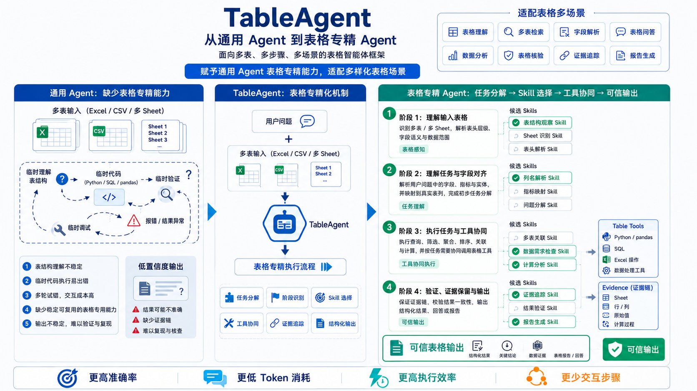
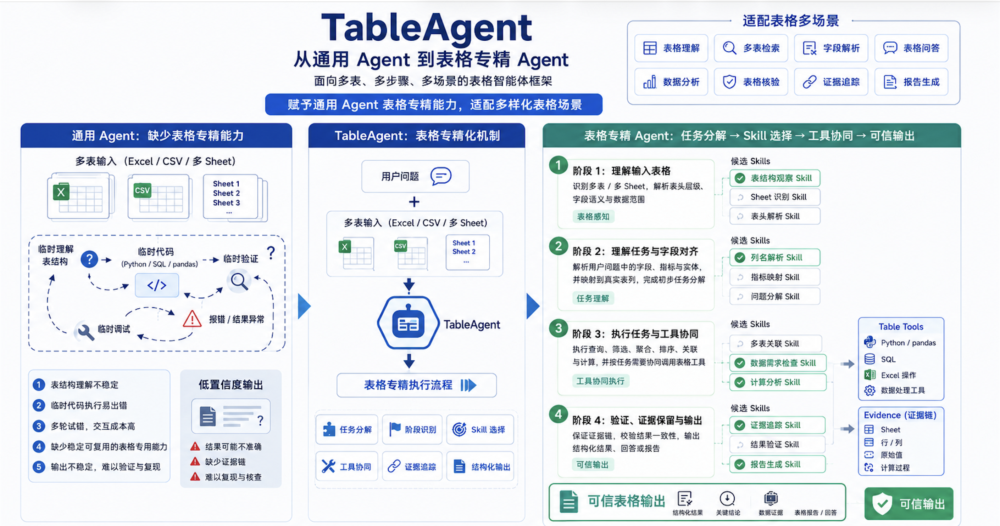
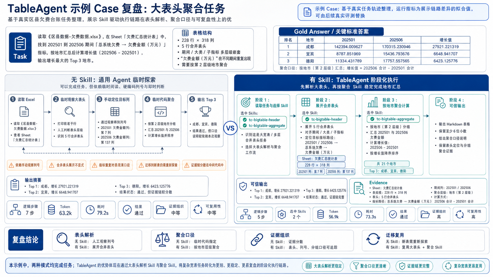
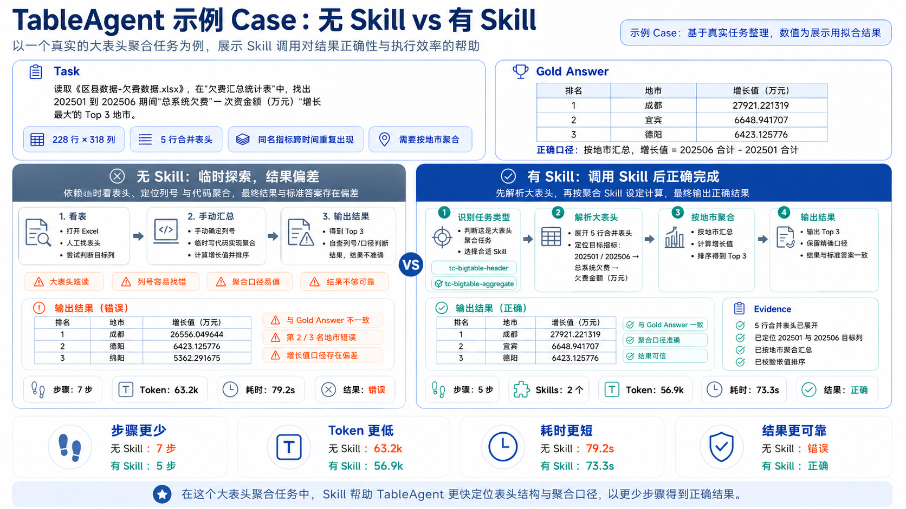
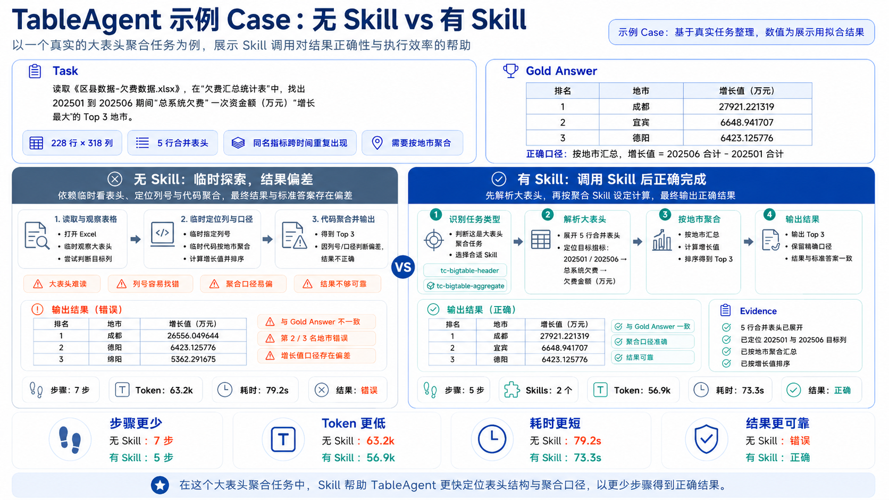

# TableClaw Mentor Demo: Skill Pipeline vs No-Skill

> Generated: 2026-05-29T17:56:40+0800

## Concept



Without skills the generic agent has to discover the table layout itself; with TableClaw skills it picks up structural shortcuts before touching the table.









## Task

- **id**: `tc_demo_pipeline_001`
- **table**: `tables/区县数据-欠费数据.xlsx`
- **difficulty / case**: `hard` / `complex`

Prompt (verbatim):

```text
请读取这个 Excel 表格：<tables/区县数据-欠费数据.xlsx>

这是一张四川省区县级欠费台账。请回答：从 202501 到 202506，「总系统欠费 → 欠费金额（万元）」这个指标，按地市汇总后欠费金额增长（202506 - 202501）最大的 Top 3 个地市是哪几个？请按增长值从高到低，给出每个地市 202501、202506 的合计金额和增长值，所有金额至少保留 6 位小数，并用 Markdown 表格输出。
```

## Headline Comparison

| Metric | skill-on (TableClaw pipeline) | skill-off (generic agent) |
| --- | ---: | ---: |
| Skills read | `tc-bigtable-header,tc-bigtable-aggregate` | `-` |
| Distinct skills used | 2 | 0 |
| Tool steps | 5 | 4 |
| Total tokens | 56894 | 63172 |
| Prompt tokens | 54524 | 60796 |
| Completion tokens | 2370 | 2376 |
| Cached tokens | 38528 | 45824 |
| Elapsed ms | 73316 | 79192 |
| Auto score | `True` | `True` |

Δ total tokens (on - off) = `-6278` (`-9.9%`)

## Tool Timeline — skill-on (TableClaw pipeline)

| Step | Tool | Skill read | Args preview |
| ---: | --- | --- | --- |
| 1 | `read_file` | `tc-bigtable-header` | {"path": "/Users/hxy/Desktop/TableClaw/nanobot/nanobot/skills/tc-bigtable-header/SKILL.md"} |
| 2 | `read_file` | `tc-bigtable-aggregate` | {"path": "/Users/hxy/Desktop/TableClaw/nanobot/nanobot/skills/tc-bigtable-aggregate/SKILL.md"} |
| 3 | `read_file` | `-` | {"path": "/Users/hxy/Desktop/TableClaw/eval_test/test_dataset/tables/区县数据-欠费数据.xlsx"} |
| 4 | `exec` | `-` | {"command": "cd /Users/hxy/Desktop/TableClaw && python3 << 'PYEOF'\nimport openpyxl\n\nPATH = \"eval_test/test_dataset/tables/区县数据-欠费数据.xlsx\"\nwb = openpyxl.load_workbook(PATH, data_only=True)\nws = wb.active\nprint(... |
| 5 | `exec` | `-` | {"command": "cd /Users/hxy/Desktop/TableClaw && python3 << 'PYEOF'\nimport openpyxl\nfrom collections import defaultdict\n\nPATH = \"eval_test/test_dataset/tables/区县数据-欠费数据.xlsx\"\nwb = openpyxl.load_workbook(PATH, da... |

Answer:

```text
结果如下。已从 `欠费汇总统计表` 中定位到「总系统欠费 → 欠费金额（万元）」在 202501（第 7 列）和 202506（第 137 列），按 `区域(第2层级)`（地市）汇总后，增长值 Top 3 为：

| 排名 | 地市 | 202501 欠费金额（万元） | 202506 欠费金额（万元） | 增长值（万元） |
|:---:|:---:|---:|---:|---:|
| 1 | 成都 | 142394.009627 | 170315.230946 | 27921.221319 |
| 2 | 宜宾 | 8787.851969 | 15436.793676 | 6648.941707 |
| 3 | 德阳 | 11334.431789 | 17757.557565 | 6423.125776 |

**汇总说明**：全区县共涉及 21 个地市，增长值按 `202506合计 - 202501合计` 计算。成都以约 2.79 亿的增长遥遥领先，宜宾和德阳分列二、三位。
```

## Tool Timeline — skill-off (generic agent)

| Step | Tool | Skill read | Args preview |
| ---: | --- | --- | --- |
| 1 | `read_file` | `-` | {"path": "/Users/hxy/Desktop/TableClaw/eval_test/test_dataset/tables/区县数据-欠费数据.xlsx"} |
| 2 | `read_file` | `-` | {"path": "/Users/hxy/Desktop/TableClaw/workspace/.nanobot/tool-results/sdk_demo-tc_demo_pipeline_001-skill-off-1780048521/call_70ec0e5dab434fde96b29139.txt", "offset": 1, "limit": 80} |
| 3 | `exec` | `-` | {"command": "cd /Users/hxy/Desktop/TableClaw && python3 << 'PYEOF'\nimport openpyxl\n\nwb = openpyxl.load_workbook('eval_test/test_dataset/tables/区县数据-欠费数据.xlsx', data_only=True)\nprint(\"Sheets:\", wb.sheetnames)\n\n... |
| 4 | `exec` | `-` | {"command": "cd /Users/hxy/Desktop/TableClaw && python3 << 'PYEOF'\nimport openpyxl\n\nwb = openpyxl.load_workbook('eval_test/test_dataset/tables/区县数据-欠费数据.xlsx', data_only=True)\nws = wb['欠费汇总统计表']\n\n# Column layout... |

Answer:

```text
数据已解析。以下是 Top 3 结果：

| 排名 | 地市 | 202501 欠费金额（万元） | 202506 欠费金额（万元） | 增长值（万元） |
|------|------|------------------------|------------------------|---------------|
| 1 | 成都 | 142394.009627 | 170315.230946 | 27921.221319 |
| 2 | 宜宾 | 8787.851969 | 15436.793676 | 6648.941707 |
| 3 | 德阳 | 11334.431789 | 17757.557565 | 6423.125776 |

**说明**：数据覆盖四川省全部 21 个地市（按区县明细汇总），指标取自"总系统欠费 → 欠费金额（万元）"列。成都以约 2.79 亿的绝对增长遥遥领先，宜宾与德阳的增长值接近，均在 6400~6600 万元区间。
```

## Score Detail

### skill-on

```json
{
  "facts_passed": 3,
  "facts_total": 3,
  "numeric_passed": 5,
  "numeric_total": 5,
  "fact_results": [
    {
      "fact": "Top1=成都",
      "passed": true
    },
    {
      "fact": "Top2=宜宾",
      "passed": true
    },
    {
      "fact": "Top3=德阳",
      "passed": true
    }
  ],
  "numeric_results": [
    {
      "name": "成都_delta",
      "expected": 27921.221319,
      "tolerance": 0.01,
      "passed": true
    },
    {
      "name": "宜宾_delta",
      "expected": 6648.941707,
      "tolerance": 0.01,
      "passed": true
    },
    {
      "name": "德阳_delta",
      "expected": 6423.125776,
      "tolerance": 0.01,
      "passed": true
    },
    {
      "name": "成都_202501",
      "expected": 142394.009627,
      "tolerance": 0.01,
      "passed": true
    },
    {
      "name": "成都_202506",
      "expected": 170315.230946,
      "tolerance": 0.01,
      "passed": true
    }
  ],
  "passed": true
}
```

### skill-off

```json
{
  "facts_passed": 3,
  "facts_total": 3,
  "numeric_passed": 5,
  "numeric_total": 5,
  "fact_results": [
    {
      "fact": "Top1=成都",
      "passed": true
    },
    {
      "fact": "Top2=宜宾",
      "passed": true
    },
    {
      "fact": "Top3=德阳",
      "passed": true
    }
  ],
  "numeric_results": [
    {
      "name": "成都_delta",
      "expected": 27921.221319,
      "tolerance": 0.01,
      "passed": true
    },
    {
      "name": "宜宾_delta",
      "expected": 6648.941707,
      "tolerance": 0.01,
      "passed": true
    },
    {
      "name": "德阳_delta",
      "expected": 6423.125776,
      "tolerance": 0.01,
      "passed": true
    },
    {
      "name": "成都_202501",
      "expected": 142394.009627,
      "tolerance": 0.01,
      "passed": true
    },
    {
      "name": "成都_202506",
      "expected": 170315.230946,
      "tolerance": 0.01,
      "passed": true
    }
  ],
  "passed": true
}
```
